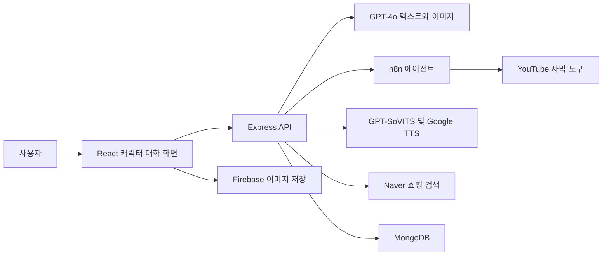

# 장금이 | 캐릭터 기반 AI 요리 어시스턴트

**좋아하는 요리사의 레시피를 찾아, 그 요리사의 말투와 목소리로 안내받으며 요리하는 웹 서비스입니다.** 백종원 유튜브의 조리법을 자막에서 가져오고, 조리 중 재료 대체·맛 조절·요리 팁을 질문할 수 있도록 구현했습니다.

2025.03~06 · 졸업설계 · 코돌 3인 팀 · **한기헌 팀장**

React · Express · MongoDB · Firebase · GPT-4o · n8n · GPT-SoVITS

## 사용자 경험

1. 캐릭터를 선택하고 요리명이나 음식 사진으로 레시피를 찾습니다.
2. 관련 유튜브 영상의 자막을 참고해 해당 요리사의 조리법을 소개합니다.
3. “이 재료가 없으면 어떻게 해?”, “덜 맵게 해줘”처럼 추가 질문을 합니다.
4. 캐릭터 말투의 답변과 합성 음성으로 안내받고, 필요한 재료의 구매 링크를 확인합니다.

최종 구현의 중심은 **백종원 캐릭터**였습니다. 말투는 프롬프트로 구성했고, 목소리는 백종원 영상에서 확보한 음성으로 GPT-SoVITS를 학습해 연결했습니다. 다른 캐릭터는 데이터 확보와 말투 일관성에 제약이 있었습니다.


*졸업설계 최종보고서에 남긴 실제 대화 화면입니다.*

## 내가 맡은 일

개인 격주보고서와 발표 대본에 근거해 팀 결과와 개인 작업을 구분했습니다.

| 담당 작업 | 진행 내용 |
|---|---|
| 레시피 데이터 | YouTube Data API·웹 수집으로 백종원 레시피 확보, QA 학습 데이터 제작 |
| 음성 모델 | 백종원 영상의 음성 수집, GPT-SoVITS 학습과 데이터 보완 |
| 모델 호출 서버 | Colab의 언어모델·음성 모델을 FastAPI로 호출하고 중간 시연 연결 |
| 에이전트와 도구 | n8n 흐름 구성, Naver 쇼핑 호출, 기존 자막 라이브러리를 활용한 커스텀 노드 제작 |
| 팀장 | 프로젝트 발표와 개발 과정 정리 |

웹 화면·서버를 포함한 서비스 전체는 팀 결과물입니다. [개발 과정](docs/DEVELOPMENT.md)에 개인 작업 시기와 기술 선택을 정리했습니다.

## 구조와 코드



| 위치 | 역할 |
|---|---|
| [server.js](server.js) | 레시피·조리 질문, 외부 음성 서버, 쇼핑 및 n8n 호출 |
| [ChatUI.jsx](front/src/components/ChatUI.jsx) | 캐릭터 대화와 n8n 연동 |
| [CookingAssistant.js](front/src/components/CookingAssistant.js) | 조리 단계·타이머·음성 안내 |
| [자막 커스텀 노드](integrations/youtube-transcript) | 자막 라이브러리를 n8n 도구로 연결한 소스 |

## 시도와 선택

초기에는 자체 LLaMA3 파인튜닝으로 요리 답변을 만들려고 했습니다. GPU·메모리 제약을 겪었고, 최종 비교에서도 GPT API보다 뚜렷한 품질 이점을 얻지 못하면서 응답이 더 느렸습니다. 최종 서비스는 GPT API와 자막·음성·쇼핑 도구를 연결하는 방식으로 전환했습니다.

**제외한 언어모델 파인튜닝과 실제 수행한 GPT-SoVITS 음성 학습은 별개의 작업**입니다. 초기 Raspberry Pi·자동 조미료 장치 구상은 최종 웹 서비스의 완성 기능에 포함하지 않았습니다.

## 실행

Node.js와 npm, MongoDB 및 각 외부 서비스의 본인 설정이 필요합니다.

```sh
# 서버
npm ci
cp .env.example .env
npm start

# 다른 터미널에서 프론트엔드
cd front
npm ci
cp .env.example .env
npm start
```

Windows에서는 `.env.example`을 `.env`로 복사한 뒤 값을 입력합니다. 서버 기본 포트는 5000, 프론트엔드는 3000입니다. OpenAI·Firebase·Naver·Google TTS 인증과 n8n·외부 음성 서버 주소는 예시 환경변수에 맞춰 설정합니다.

## 보관 범위

- 현재 화면에서 연결되는 코드와 자막 노드를 선별했습니다. 미사용 화면·백업·실험·생성 파일은 제외했습니다.
- n8n 전체 워크플로우, 음성 학습 가중치·원본 음성, API 인증정보는 포함하지 않습니다. 이 복사본만으로 당시 외부 환경 전체가 재현되지는 않습니다.
- 회원·기록 기능에는 미완성 연결이 남아 있으며, 완성된 인증 서비스로 소개하지 않습니다.
- 응답·음성 생성 지연과 모바일 최적화는 당시의 개선 과제입니다.
- 2026년 공개 정리 중 수정한 부분은 [정리 기록](docs/CURATION.md)에 따로 적었습니다.

공개 전 서버·프론트엔드의 `npm ci`, 서버 문법 검사와 프론트엔드 배포 빌드를 통과했습니다. 외부 서비스까지 연결한 전체 동작 검증은 별도 환경이 필요합니다.
