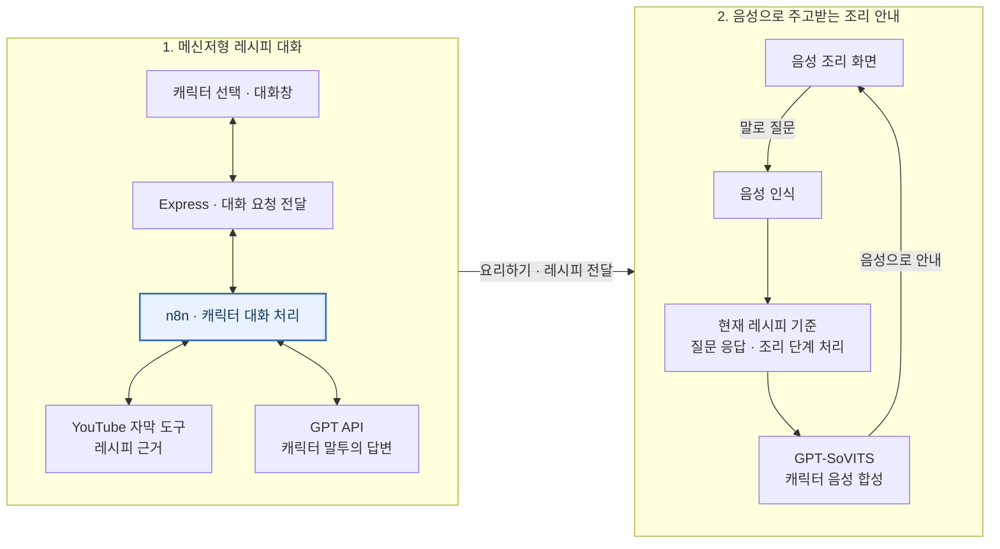

# 장금이 · 캐릭터와 대화하며 요리하는 AI 어시스턴트

**캐릭터와 메신저처럼 대화해 레시피를 정하고, '요리하기'를 누르면 음성으로 묻고 답하며 조리하는 웹 서비스입니다.**

요리 영상을 보다 궁금한 점이 생겨도 영상 속 요리사에게 바로 물어볼 수는 없습니다. 장금이는 좋아하는 요리사와 대화하듯 레시피를 찾고, 조리 중에도 손으로 입력할 필요 없이 질문할 수 있도록 만들었습니다. 백종원 요리 유튜브의 레시피와 캐릭터 말투, GPT-SoVITS로 학습한 합성 음성을 활용했습니다.

| 구분 | 내용 |
|---|---|
| 기간 | 2025.03–06 · 졸업설계 |
| 팀원 | **한기헌(팀장) · 최원빈 · 양재혁** |
| 맡은 역할 | 레시피·음성 데이터 수집, GPT-SoVITS 학습, n8n 자막 도구 구성, 모델 호출용 FastAPI 시연 서버 |
| 주요 기술 | React · Express · n8n · GPT API · GPT-SoVITS · FastAPI |

*메신저처럼 질문과 답변을 주고받으며 레시피를 확인하는 화면입니다.*

## 어떻게 사용하나요?

### 1. 캐릭터를 고르고 대화 시작

캐릭터를 선택하면 대화창이 열립니다. 말풍선 형태로 메시지를 주고받으며 원하는 요리를 묻습니다. 최종 시연은 백종원 캐릭터를 중심으로 구현했습니다.

### 2. 대화로 레시피 확인

요리명을 말하면 레시피와 재료를 안내합니다. 대화 중 재료 대체나 맛 조절처럼 궁금한 내용을 추가로 물어볼 수 있습니다. **이 메신저형 대화의 중심은 n8n**이며, 관련 영상의 자막을 답변 근거로 활용하고 캐릭터의 말투로 응답합니다.

### 3. '이 레시피로 요리하기'로 전환

대화에서 확인한 레시피의 **'이 레시피로 요리하기'** 버튼을 누르면 해당 레시피를 조리 화면으로 가져갑니다. 대화로 정한 요리를 실제 조리 단계에서 안내받는 흐름입니다.

### 4. 말로 묻고, 캐릭터 음성으로 답변 듣기

조리 중에는 키보드 입력 대신 음성으로 질문합니다. 현재 레시피에 대해 물어보거나 다음 단계를 요청하면 캐릭터의 합성 음성으로 안내합니다. **레시피를 함께 고르는 채팅과, 요리하면서 주고받는 음성 대화**를 하나의 사용 흐름으로 구성했습니다.

## 시스템 구조

n8n이 레시피 탐색과 캐릭터 대화를 처리하고, 선택한 레시피를 음성 조리 화면에서 사용합니다. 아래는 최종 서비스의 핵심 기능 흐름입니다.

- **n8n 대화:** 웹에서 세션 ID·캐릭터·메시지를 전달하고, n8n의 응답을 대화창에 표시합니다.
- **레시피 전달:** 대화에서 선택한 레시피를 조리 화면으로 넘깁니다.
- **음성 조리:** 질문을 음성으로 인식하고, 레시피에 맞는 답변이나 단계 안내를 합성 음성으로 재생합니다.

### 기술별 역할

| 기술 | 사용한 부분 |
|---|---|
| React | 캐릭터 선택, 메신저형 대화, 레시피 선택, 음성 조리 화면 |
| Express | 웹의 대화 요청을 n8n에 전달하고 조리·음성 요청 처리 |
| n8n | 레시피 관련 도구 실행과 캐릭터 대화 흐름 구성 |
| GPT API | 자막을 활용한 레시피 답변과 조리 질문 응답 생성 |
| Web Speech API | 조리 중 사용자의 한국어 음성 입력 |
| GPT-SoVITS | 학습한 캐릭터 목소리로 안내 문장 합성 |
| FastAPI · Colab | 개발 중 모델을 HTTP 요청으로 호출하는 시연 환경 |

## 맡은 역할

저는 팀장으로 데이터 수집, 음성 모델 학습, n8n 도구 구성과 모델 호출 서버를 담당했습니다. 웹 화면과 전체 서비스는 최원빈·양재혁과 함께 개발했습니다.

### 레시피·음성 데이터 수집과 GPT-SoVITS 학습

백종원 요리 영상에서 레시피와 음성 데이터를 수집했습니다. 레시피는 초기 언어모델 학습을 위한 QA 데이터로 정리했고, 음성은 GPT-SoVITS 학습에 사용했습니다. 음성 데이터를 추가하며 합성 결과를 확인하고 조리 안내 문장을 생성했습니다.

레시피의 근거는 영상 자막으로, 캐릭터의 말투는 프롬프트로, 목소리는 학습한 음성 모델로 구현했습니다.

### n8n에서 사용할 자막 커스텀 노드 제작

관련 영상의 자막을 대화에 활용할 수 있도록 기존 youtube-transcript 라이브러리를 n8n 커스텀 노드로 구성했습니다. 영상 URL과 언어 코드를 입력받아 자막을 가져오고, 자막 배열을 다음 처리 단계에 전달하도록 입력 필드와 실행·출력 형식을 작성했습니다.

[자막 노드 코드](integrations/youtube-transcript/YoutubeTranscript.node.ts) · [노드 구성](integrations/youtube-transcript/README.md)

### 모델 호출 서버 구성과 시연

Colab에서 실행한 언어모델과 음성 모델을 HTTP 요청으로 호출하도록 FastAPI 서버를 구성했습니다. 중간 시연 영상을 제작하며 모델 호출과 응답 지연을 확인했습니다. 이 서버는 개발 중 모델을 시험하기 위한 구성으로, 저장소의 Express 웹 서버와 역할이 다릅니다.

## 개발 과정에서 조정한 부분

| 초기 접근 | 확인한 문제와 판단 | 최종 적용 |
|---|---|---|
| 수집한 레시피 QA로 언어모델 학습 | Colab의 GPU·메모리 제약이 있었고, 응답 품질과 속도에서도 GPT API 대비 이점이 뚜렷하지 않았습니다. | 대화 응답에는 GPT API를 사용하고, 캐릭터 음성은 GPT-SoVITS로 학습했습니다. |
| 사진이나 검색어를 입력해 레시피를 한 번에 조회 | 원하는 요리를 함께 정하고 조리 중에도 질문하는 경험을 중심으로 방향을 바꿨습니다. | n8n 기반 메신저형 대화에서 레시피를 얻고, '요리하기'로 음성 조리를 시작하도록 구성했습니다. |

사진 업로드 후 GPT API로 레시피를 찾는 화면과 Naver 쇼핑 기능은 **초기 구현**입니다. 최종 서비스 소개와 구조도에서는 제외했으며, 남아 있는 코드의 용도는 [개발 이력과 코드 구분](docs/DEVELOPMENT_HISTORY.md)에 정리했습니다.

## 코드와 실행

| 확인할 부분 | 코드 |
|---|---|
| 메신저형 대화와 '요리하기' 버튼 | [ChatUI.jsx](front/src/components/ChatUI.jsx) |
| 세션·캐릭터·메시지 전송 | [api.js](front/src/api.js) · [server.js](server.js)의 `POST /api/test-command` |
| 대화에서 받은 레시피의 조리 화면 전달 | [MainApp.js](front/src/components/MainApp.js) |
| 음성 입력·조리 응답·음성 재생 | [CookingAssistant.js](front/src/components/CookingAssistant.js) |
| n8n 자막 도구 | [YoutubeTranscript.node.ts](integrations/youtube-transcript/YoutubeTranscript.node.ts) |

Node.js·npm·MongoDB와 n8n·음성 서버 등 외부 실행 환경이 필요합니다. 루트와 `front`의 환경변수를 설정한 뒤 각각 `npm ci`, `npm start`로 실행합니다. 구체적인 준비 사항은 [실행 안내](docs/SETUP.md)에 정리했습니다.

n8n 전체 워크플로우, 음성 추론 서버와 학습 가중치는 이 저장소에 포함하지 않았습니다. 개발 중 사용한 초기 화면도 함께 보관했습니다. 최종 서비스와 초기 시도의 차이는 [개발 이력](docs/DEVELOPMENT_HISTORY.md)에 정리했습니다.

졸업설계 발표와 시연에서는 캐릭터 대화에서 음성 조리로 전환하는 흐름을 보여주었습니다. 응답 생성과 음성 합성의 지연은 이후 개선할 과제로 남겼습니다.

[실행 안내](docs/SETUP.md) · [개발 이력과 코드 구분](docs/DEVELOPMENT_HISTORY.md) · [공개용 정리 내역](docs/CURATION.md)
