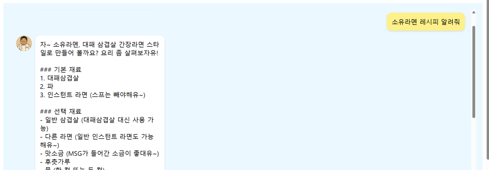
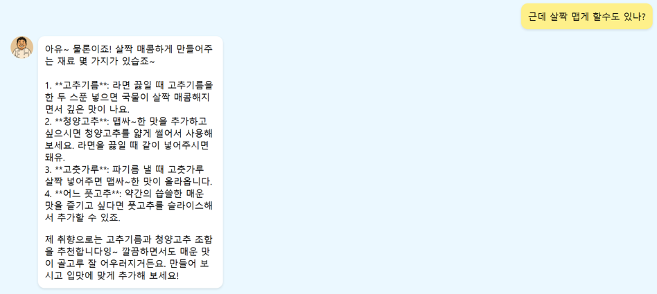
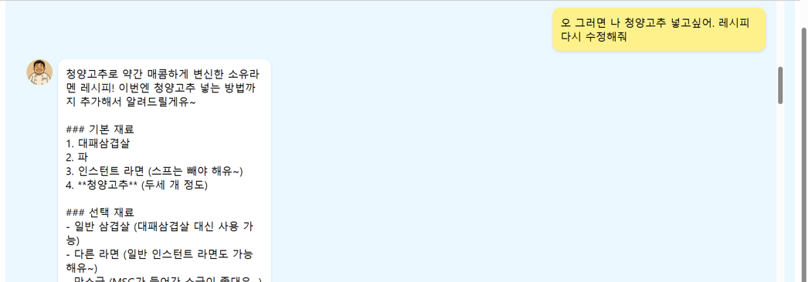
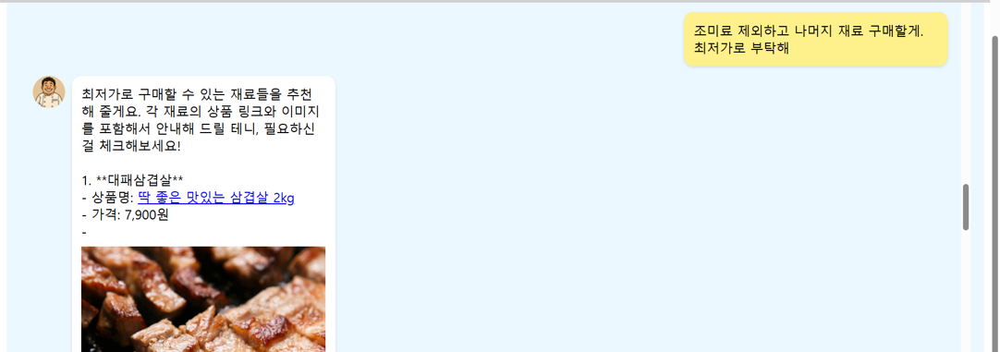
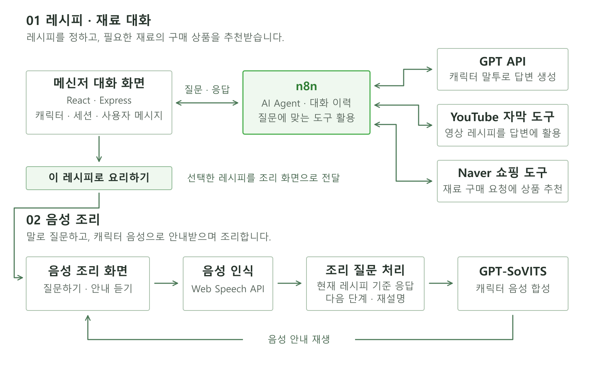
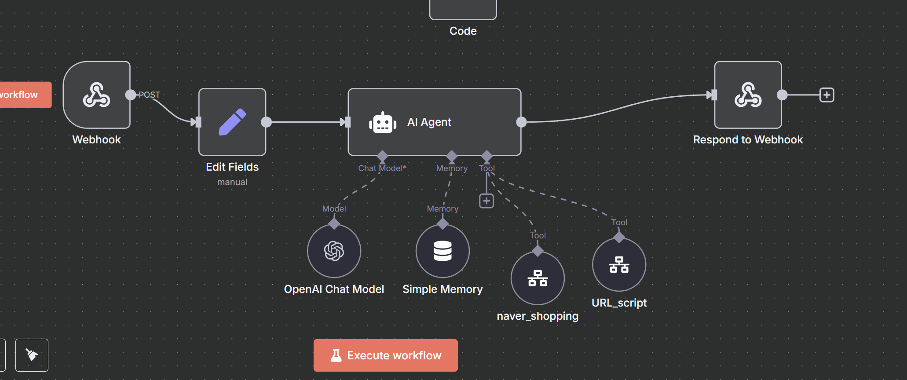

# 장금이 · 캐릭터와 대화하며 요리하는 AI 어시스턴트

캐릭터와 메신저처럼 대화해 레시피를 정하고, '요리하기'를 누르면 음성으로 묻고 답하며 조리하는 웹 서비스입니다.

2025.03–06 · 졸업설계 
한기헌(팀장) · 최원빈 · 양재혁

요리 영상을 보다 궁금한 점이 생겨도 영상 속 요리사에게 바로 물어볼 수는 없습니다.
장금이는 좋아하는 요리사에게 재료와 조리법을 묻고, 요리하는 중에도 손으로 입력할 필요 없이 질문할 수 있도록 만들었습니다.
백종원 요리 유튜브의 레시피와 캐릭터 말투, GPT-SoVITS로 학습한 합성 음성을 활용했습니다.

## 시연 화면

캐릭터를 선택하면 메신저형 대화창이 열립니다. 원하는 요리를 묻고, 답변을 보면서 재료나 취향을 이야기할 수 있습니다.
최종 시연은 백종원 캐릭터를 중심으로 구현했습니다. 아래 이미지는 당시 시연 화면입니다.

### 레시피 질문

요리명을 입력하면 캐릭터 말투로 재료와 조리법을 안내합니다. n8n에서 관련 영상의 자막을 답변 근거로 활용했습니다.

### 맛에 관한 추가 질문

기존 레시피를 살짝 맵게 만드는 방법을 대화창에서 묻습니다. 고추기름이나 청양고추를 활용하는 방법을 안내받는 장면입니다.

### 재료를 추가해 레시피 수정

안내받은 방법 중 청양고추를 선택하고, 이를 반영해 레시피를 다시 요청합니다.
대화에서 레시피를 정한 뒤 '이 레시피로 요리하기'를 누르면 해당 레시피를 조리 화면으로 가져가고, 이후에는 음성으로 질문하고 캐릭터 음성으로 안내받습니다.

### 채팅으로 재료 구매 요청

레시피를 정한 뒤 필요한 재료를 구매하고 싶다고 말하면, n8n의 `naver_shopping` 도구로 상품을 추천합니다.
시연에서는 조미료를 제외한 재료를 요청하고, 대화창에서 상품명·가격·구매 링크를 확인했습니다.

## 시스템 구조

React 대화창에서 보낸 세션·캐릭터·메시지를 Express가 n8n에 전달합니다.
n8n의 AI Agent는 대화 이력을 참고하며 GPT API와 도구를 활용합니다. 레시피 질문에는 영상 자막을 활용하고, 재료 구매 요청에는 Naver 쇼핑 도구로 상품을 추천합니다.

선택한 레시피는 음성 조리 화면에서 사용합니다. Web Speech API로 한국어 질문을 인식하고, 현재 레시피에 맞는 답변이나 조리 단계 안내를 GPT-SoVITS 음성으로 재생합니다.
메신저 대화와 음성 조리는 이처럼 레시피를 공유하는 두 흐름으로 구성했습니다.

### n8n 워크플로우

개발 당시 구성한 워크플로우입니다. 레시피 질문과 재료 구매 요청을 같은 대화창에서 처리하도록 만들었습니다.

1. **요청 수신** — `Webhook`으로 메시지를 받고, `Edit Fields`에서 에이전트 입력을 정리합니다.
2. **대화와 도구 활용** — `AI Agent`가 `OpenAI Chat Model`과 `Simple Memory`를 사용해 대화 문맥을 반영합니다. `URL_script`와 `naver_shopping`을 도구로 사용합니다.
3. **답변 반환** — `Respond to Webhook`이 처리 결과를 반환하고, Express를 거쳐 대화창에 답변을 표시합니다.

## 맡은 역할

저는 팀장으로 레시피·음성 데이터 수집, 음성 모델 학습, n8n 도구 구성과 모델 호출 서버를 담당했습니다.
웹 화면과 전체 서비스는 최원빈·양재혁과 함께 개발했습니다.

### 데이터 수집과 캐릭터 음성 학습

백종원 요리 영상에서 레시피와 음성 데이터를 수집했습니다.
레시피는 초기 언어모델 학습을 위한 QA 데이터로 정리했고, 음성은 GPT-SoVITS 학습에 사용했습니다.
음성 데이터를 추가하며 합성 결과를 확인하고, 학습한 모델로 조리 안내 문장을 생성했습니다.

캐릭터의 레시피는 영상 자막을 활용하고, 말투는 프롬프트로 지정하며, 목소리는 음성 모델로 합성했습니다.

### n8n 자막 커스텀 노드

기존 youtube-transcript 라이브러리를 n8n에서 사용할 수 있도록 커스텀 노드를 만들었습니다.
영상 URL과 언어 코드를 입력받아 자막을 가져오고, 자막 배열을 다음 처리 단계에 전달하도록 입력 필드·실행 함수·출력 형식을 작성했습니다.

[노드 코드](integrations/youtube-transcript/YoutubeTranscript.node.ts) · [구성과 재현 범위](integrations/youtube-transcript/README.md)

### 모델 호출 서버와 시연

Colab에서 실행한 언어모델과 음성 모델을 HTTP 요청으로 호출하도록 FastAPI 서버를 구성했습니다.
중간 시연 영상을 제작하며 모델 호출과 응답 지연을 확인했습니다.
FastAPI는 개발 중 모델을 시험한 환경이며, 저장소의 Express 웹 서버와 역할이 다릅니다.

## 개발 과정에서 내린 판단

초기에는 수집한 레시피 QA로 LLaMA3를 학습하려 했지만, Colab의 GPU·메모리 제약이 있었습니다.
팀의 최종 평가에서도 GPT API 대비 응답 품질과 속도의 이점이 뚜렷하지 않았습니다.
그래서 대화 응답에는 GPT API를 사용하고, 캐릭터 목소리는 직접 학습한 GPT-SoVITS로 구현했습니다.

레시피를 한 번에 조회하는 화면에서 시작했지만, 최종적으로는 대화하면서 요리를 정하고 조리 중에도 질문하는 경험에 집중했습니다.
응답 생성과 음성 합성의 지연은 발표·시연 이후에도 개선할 과제로 남겼습니다.

## 코드 살펴보기

- [ChatUI.jsx](front/src/components/ChatUI.jsx): 메신저형 대화와 '이 레시피로 요리하기' 버튼
- [MainApp.js](front/src/components/MainApp.js): 대화에서 받은 레시피를 처리해 조리 화면에 전달하는 부분과 초기 조회 화면
- [CookingAssistant.js](front/src/components/CookingAssistant.js): 음성 입력, 조리 질문, 합성 음성 재생
- [api.js](front/src/api.js) · [server.js](server.js): 웹 요청과 n8n·조리·음성 API 처리

## 실행 안내

Node.js·npm·MongoDB와 n8n·음성 서버 등 외부 실행 환경이 필요합니다.
루트와 `front`의 환경변수를 설정한 뒤 각각 `npm ci`, `npm start`로 실행합니다.
설정 항목과 보관 코드의 처리 경로는 [실행 안내](docs/SETUP.md)에 정리했습니다.

n8n 구성은 위 스크린샷으로 남겼으며, 실행용 워크플로우 JSON·음성 추론 서버·학습 가중치는 이 저장소에 포함하지 않았습니다.
사진 업로드 후 GPT API로 레시피를 직접 조회하던 방식과 별도 구매 화면은 초기 구현입니다. n8n 채팅에서 상품을 추천하는 기능과는 구분했으며, 관련 코드는 [개발 이력과 코드 구분](docs/DEVELOPMENT_HISTORY.md)에 정리했습니다.

[실행 안내](docs/SETUP.md) · [개발 이력](docs/DEVELOPMENT_HISTORY.md) · [공개용 정리 내역](docs/CURATION.md)
