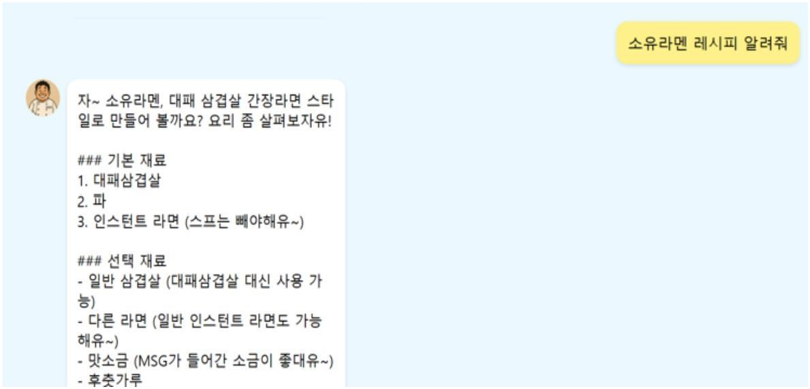
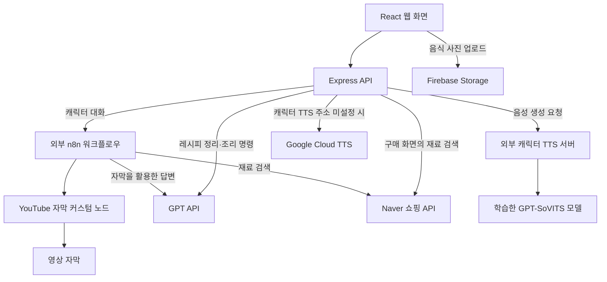

# 장금이 · 캐릭터 기반 AI 요리 어시스턴트

**백종원 요리 유튜브의 레시피를 찾아 소개하고, 캐릭터의 말투와 합성 음성으로 조리를 돕는 웹 프로토타입입니다.**

영상을 따라 요리하다 보면 재료를 바꾸거나 맛을 조절하고 싶을 때 바로 질문하기 어렵습니다. 장금이는 좋아하는 요리사와 대화하듯 레시피를 찾고, 조리 중 생기는 질문에 답하며, 다음 순서를 음성으로 안내하는 경험을 목표로 만들었습니다.

| 구분 | 내용 |
| --- | --- |
| 기간 | 2025.03–06 · 졸업설계 |
| 팀 | 3인 팀 · 팀장 한기헌 |
| 개인 담당 | 레시피·음성 데이터 수집, GPT-SoVITS 학습, n8n 도구 구성, 모델 호출용 FastAPI 시연 서버 |
| 주요 기술 | React · Express · GPT-4o · n8n · GPT-SoVITS · FastAPI |



*시연 화면: 요리명을 입력하면 재료와 조리법을 캐릭터 말투로 안내합니다.*

## 사용 흐름과 주요 기능

1. **캐릭터 선택** — 원하는 캐릭터를 고르고 요리 대화를 시작합니다.
2. **레시피 탐색** — 요리명을 묻거나 음식 사진을 입력하고, 재료와 조리 순서를 확인합니다.
3. **조리 시작** — 단계별 안내를 듣고, 음성으로 다음 단계·재설명·타이머를 요청합니다.
4. **추가 질문과 재료 검색** — 재료 대체나 맛 조절을 질문하고, 필요한 재료의 쇼핑 결과를 확인합니다.

| 기능 | 구현 방식 |
| --- | --- |
| 캐릭터 대화 | n8n에서 영상 자막을 활용해 답변하고, 프롬프트로 캐릭터 말투를 지정 |
| 레시피 정리 | 텍스트·음식 사진을 GPT-4o에 전달해 요리명·재료·조리 순서로 구조화 |
| 음성 조리 보조 | Web Speech API로 한국어 명령을 받아 단계 이동·재설명·타이머 설정 |
| 캐릭터 음성 | GPT-SoVITS로 학습한 백종원 스타일의 합성 음성으로 안내 |
| 재료 구매 탐색 | Naver 쇼핑 검색 결과와 상품 링크 표시 |

최종 시연은 **백종원 캐릭터를 중심으로 구현**했습니다. 화면에는 다른 캐릭터 선택지도 있지만, 모든 캐릭터의 데이터와 음성을 같은 수준으로 완성한 것은 아닙니다.

## 시스템 구조

공개 웹 소스에는 캐릭터 대화를 n8n에 전달하는 경로와, 레시피·조리·음성을 Express에서 처리하는 경로가 함께 있습니다.



React 화면과 Express 서버, 자막 노드 소스는 이 저장소에 있습니다. **n8n 전체 워크플로우와 음성 추론 서버는 외부 구성 요소**이며, 실행하려면 별도로 준비해야 합니다. 개인 작업의 FastAPI 서버는 Colab 모델을 호출하는 시연용으로 구성한 것으로, 공개된 Express 서버와 구분합니다.

### 기술별 역할

| 기술 | 맡은 역할 |
| --- | --- |
| React | 캐릭터 선택, 대화, 레시피 표시, 조리 단계와 타이머 화면 |
| Express | 웹 요청 처리, GPT·n8n·음성·쇼핑 API 호출 |
| GPT-4o | 텍스트·사진에서 레시피 구조화, 조리 질문에 답변·명령 분류 |
| n8n | 사용자 요청에 따른 외부 도구 실행과 자막 기반 대화 흐름 |
| GPT-SoVITS / FastAPI | 캐릭터 음성 학습·합성 / Colab 모델 호출 시연 |
| Firebase / MongoDB | 음식 사진 저장 / 회원·레시피 데이터 모델 |

## 개인 기여

한기헌은 팀장으로 데이터 수집·모델 학습·외부 도구·시연 서버를 담당했습니다. 아래는 개인 담당 작업이며, React 웹 화면과 전체 서비스는 팀 공동 결과물입니다.

### 1. 백종원 레시피·음성 데이터 수집과 음성 학습

백종원 요리 영상에서 레시피와 음성 데이터를 수집했습니다. 초기에는 레시피를 QA 학습 데이터로 정리해 언어모델 학습을 시도했고, 음성은 GPT-SoVITS 학습에 사용했습니다. 음성 데이터를 추가하며 품질을 확인하고, 학습한 모델로 조리 안내 문장을 합성했습니다.

레시피의 출처, 캐릭터의 말투, 합성 목소리는 각각 다르게 처리했습니다. 레시피는 영상 자막을 활용하고, 말투는 프롬프트로 지정하며, 목소리는 학습한 음성 모델로 생성했습니다.

### 2. n8n 자막 커스텀 노드와 쇼핑 도구 구성

n8n에서 관련 영상의 자막을 가져와 답변에 활용하고, Naver 쇼핑 API로 재료를 검색하는 흐름을 구성했습니다. 자막 기능은 기존 youtube-transcript 라이브러리를 감싸는 커스텀 노드로 제작했습니다.

- 입력: 영상 URL과 언어 코드
- 처리: `YoutubeTranscript.fetchTranscript` 호출
- 출력: 영상 URL, 언어, 자막 배열을 다음 노드에 전달

기존 라이브러리를 n8n에서 사용하도록 입력 필드·실행 함수·출력 형식을 구현한 작업입니다. 공개 파일은 노드 구현 기록이며, 설치 가능한 배포 패키지로 제공하려면 의존 경로와 등록 설정을 정비해야 합니다.

[자막 노드 코드](integrations/youtube-transcript/YoutubeTranscript.node.ts) · [구현과 재현 범위](integrations/youtube-transcript/README.md)

### 3. Colab 모델 호출 서버와 시연

Colab에서 실행한 언어모델과 음성 모델을 HTTP 요청으로 호출하도록 FastAPI 서버를 구성하고 중간 시연 영상을 제작했습니다. 호출 성공 여부와 응답 지연을 확인했으며, 최종 서비스에서는 아래 기준으로 대화 모델을 선택했습니다.

## 개발 과정에서 내린 판단

### 대화 모델은 직접 학습보다 응답 품질과 속도를 우선

초기에는 수집한 레시피 QA로 LLaMA3를 학습하려 했지만 Colab의 GPU·메모리 제약이 있었습니다. 팀의 최종 평가에서도 GPT API보다 뚜렷한 품질 이점이 없고 응답이 느렸습니다. 따라서 최종 대화는 GPT API로 처리하고, 캐릭터 목소리는 실제 학습한 GPT-SoVITS로 구현했습니다.

### 학습용 레시피 수집에서 요청에 맞는 자막 활용으로 전환

초기 수집은 언어모델 학습용 데이터를 만드는 목적이었습니다. 후반에는 사용자의 요청과 관련된 영상을 찾고, 그 자막을 가져와 답변 근거로 쓰는 흐름을 구성했습니다. 이 과정에서 자막 수집 코드를 n8n 노드로 만들어 다른 도구와 함께 사용할 수 있도록 했습니다.

## 코드에서 확인할 수 있는 API

| API | 역할 | 주요 호출부 |
| --- | --- | --- |
| `POST /api/test-command` | 세션 ID·캐릭터·질문을 n8n 웹훅으로 전달 | [ChatUI.jsx](front/src/components/ChatUI.jsx) |
| `POST /upload` | 텍스트 또는 사진을 재료·조리 순서가 있는 레시피로 변환 | [MainApp.js](front/src/components/MainApp.js) |
| `POST /assistant` | 현재 레시피를 바탕으로 질문에 답하고 단계·타이머 명령 반환 | [CookingAssistant.js](front/src/components/CookingAssistant.js) |
| `POST /tts` | 문장을 외부 음성 서버에 전달하고 음성 데이터를 반환 | [CookingAssistant.js](front/src/components/CookingAssistant.js) |
| `GET /api/search` | 재료 이름으로 Naver 쇼핑 검색 | [PurchasePage.js](front/src/pages/PurchasePage.js) |

API 구현은 [server.js](server.js), 화면 라우팅은 [App.js](front/src/App.js), 회원·레시피 데이터 구조는 [models](models)에서 확인할 수 있습니다. 조리 보조 API의 답변 말투는 현재 코드에서 백종원 스타일로 지정되어 있습니다.

## 실행 안내

Node.js·npm·MongoDB와 외부 서비스 설정이 필요합니다. 루트와 `front`의 `.env.example`을 각각 `.env`로 복사해 값을 입력합니다.

```sh
# 저장소 루트: API 서버, 기본 포트 5000
npm ci
npm start
```

```sh
# 별도 터미널: React 화면, 기본 포트 3000
cd front
npm ci
npm start
```

| 실행할 기능 | 필요한 설정 |
| --- | --- |
| 서버·레시피·조리 질문 | `JWT_SECRET`, `MONGO_URI`, `OPENAI_API_KEY` |
| 캐릭터 대화 | `N8N_WEBHOOK_URL`과 별도 n8n 워크플로우 |
| 캐릭터 음성 | `TTS_BAEK_URL` 등 외부 TTS 주소와 해당 서버의 모델·참조 음성 |
| 기본 음성 | Google Cloud TTS 인증 설정 |
| 음식 사진·재료 검색 | Firebase 설정 / Naver API의 `CLIENT_ID`, `CLIENT_SECRET` |

브라우저 음성 입력에는 마이크 권한과 Web Speech API 지원이 필요합니다. 상세 설정은 [실행 안내](docs/SETUP.md), 공개 과정의 수정 사항은 [공개본 유지보수](docs/CURATION.md)를 참고하세요.

## 결과와 공개 범위

레시피 탐색, 캐릭터 대화·합성 음성, 조리 단계 안내, 재료 검색을 다루는 웹 프로토타입을 제작하고 졸업설계 발표·시연을 진행했습니다. 응답 생성과 음성 합성의 지연은 최종 보고서에 남긴 개선 과제입니다.

- **포함:** 웹 화면, Express API, 데이터 모델, n8n 자막 노드 소스, 환경변수 예시, 시연 이미지.
- **별도 준비:** n8n 전체 워크플로우, FastAPI·음성 추론 서버, 음성 학습 데이터·가중치, 외부 서비스 인증정보.
- **남은 제약:** 회원·로그인·검색 기록의 전체 흐름과 타이머 카운트다운·종료 알림은 미완성입니다. 외부 서비스를 모두 준비한 상태의 재실행은 공개 정리 과정에서 검증하지 않았습니다.

설치·빌드를 위한 공개본 유지보수는 졸업설계 당시의 개인 기여와 구분해 기록했습니다.
